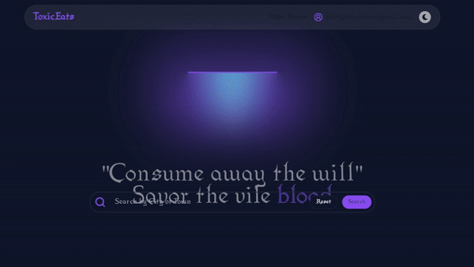

# ToxicEats Food Ordering Web App

 

## Description
ToxicEats is a food ordering web app that allows users to order food from a variety of restaurants. Users can create an account, browse restaurants, view menus, and place orders. The app also includes a feature that allows users to track their order in real-time. The app uses Stripe API for payment processing and MongoDB for data storage.

## Features
- User authentication
- Restaurant browsing
- Menu viewing
- Order placement
- Real-time order tracking
- User reviews
- Restaurant ratings
- User profiles
  
## Technologies
- React
- Node.js
- Express
- MongoDB
- Tailwind CSS
- Stripe API

