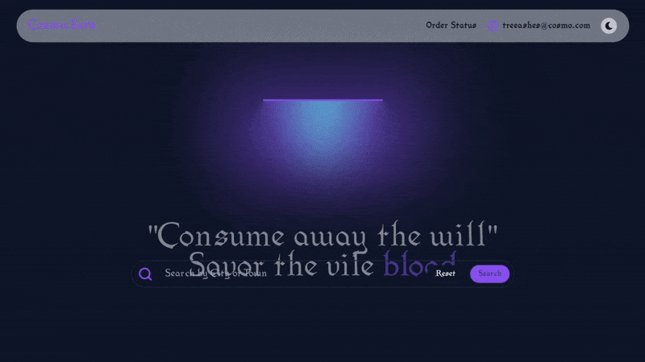

<div align="center">

</div>
<br>

<div align="center">
  
</div>
<br>

# `CozmicEats` Food Ordering Web App

CozmicEats is a food ordering web app that allows users to order food from a variety of restaurants. Users can `create an account`, `browse restaurants`, `view menus`, and `place orders`. The app also includes a feature that allows users to `track orders` in real-time. The app uses `Stripe API` for payment processing and `MongoDB` for data storage.

> [!NOTE]\
> The food items and the theme of the app are fictional and they are based on medieval and fantasy themes. Some might find them humorous or distasteful 🫠. But don't worry, the app is intended for demonstration purposes only. And for FUN!

## Features

```md
- User authentication
- Restaurant browsing
- Menu viewing
- Order placement
- Real-time order tracking
- User reviews
- Restaurant ratings
- User profiles
- Payment processing
```

## Technologies

```md
- React
- TypeScript
- Node.js
- Express
- MongoDB
- Tailwind CSS
- Stripe API
- JavaScript
- HTML
- CSS
```

#

Hope you enjoy those cosmic snacks. `Cheers!!` 🌚👽🥩
